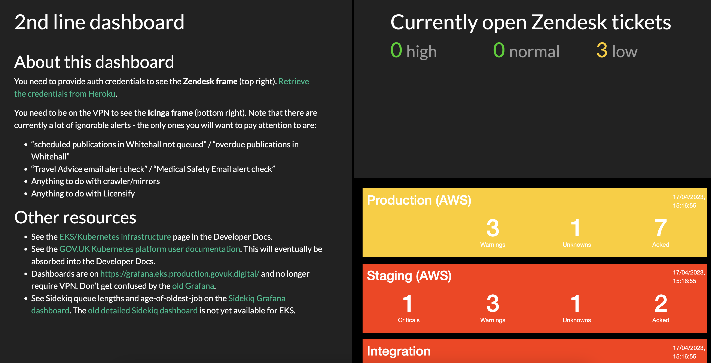
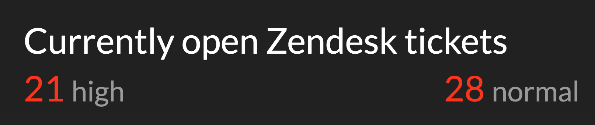

# GOV.UK Technical 2nd line dashboard

Displays high-level statistics from Zendesk and Icinga, and links to useful resources.
This dashboard is a Sinatra app, hosted on Heroku, and intended to be used by GOV.UK Technical 2nd line.

## Using the dashboard

Bookmark `https://govuk-2ndline-dashboard.herokuapp.com/`. It will automatically redirect to the latest iteration of the dashboard. Try to avoid bookmarking the `/frame-splits` URL itself, as then you won't benefit from future changes.

## Running the app locally

Replace the following variables with values [retrieved from Heroku](https://dashboard.heroku.com/apps/govuk-2ndline-dashboard/settings).

```
ZENDESK_SUBDOMAIN='govuk' \
ZENDESK_VIEW_ID='30791708' \
ZENDESK_API_USERNAME='something@example.com' \
ZENDESK_API_TOKEN='ABCDEFG' \
AUTH_USERNAME='username' \
AUTH_PASSWORD='password' \
bundle exec puma
```

## Configuring the frame splits

Edit the constants at the top of `displayscreen.rb` to adjust the layout or the `src` of any frame.

You can visit the `/build` endpoint to experiment with different dashboard layouts and sources.

### Colour coding

All stats are coloured green if they are 0, amber if they are between 1 and 4, and red if they are 5 or over.

### Dark mode

Dark mode is set by default and results in a dark background and light text. To disable dark mode, add `?dark_mode=false` to the URL.

### Hiding the low queue

The low queue is regularly used for tickets that are handed off to others or awaiting some other action, therefore the display screen hides it by default. To show it, add `?hide_low_queue=false` to the URL.

## Screenshots

- 
- 

## Licence

[MIT License](LICENCE)
