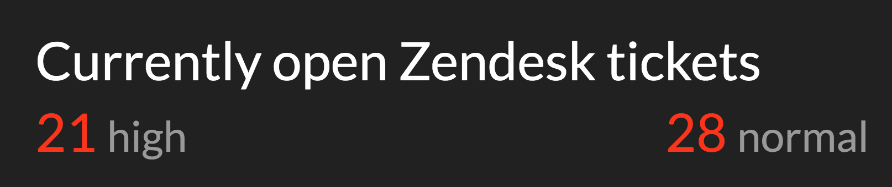

# GOV.UK Zendesk Display Screen

Displays some high-level statistics from a given Zendesk view. Used to display the number of tickets currently on the 2nd line queue.

## Running

`ZENDESK_SUBDOMAIN=govuk ZENDESK_API_USERNAME=something@example.com ZENDESK_API_TOKEN=ABCDEFG ZENDESK_VIEW_ID=123456789 AUTH_USERNAME=username AUTH_PASSWORD=password bundle exec puma`

### Colour coding

All stats are coloured green if they are 0, amber if they are between 1 and 4, and red if they are 5 or over.

### Dark mode

Dark mode is set by default and results in a dark background and light text. To disable dark mode, add `?dark_mode=false` to the URL.

### Hiding the low queue

The low queue is regularly used for tickets that are handed off to others or awaiting some other action, therefore the display screen hides it by default. To show it, add `?hide_low_queue=false` to the URL.

## Licence

[MIT License](LICENCE)
